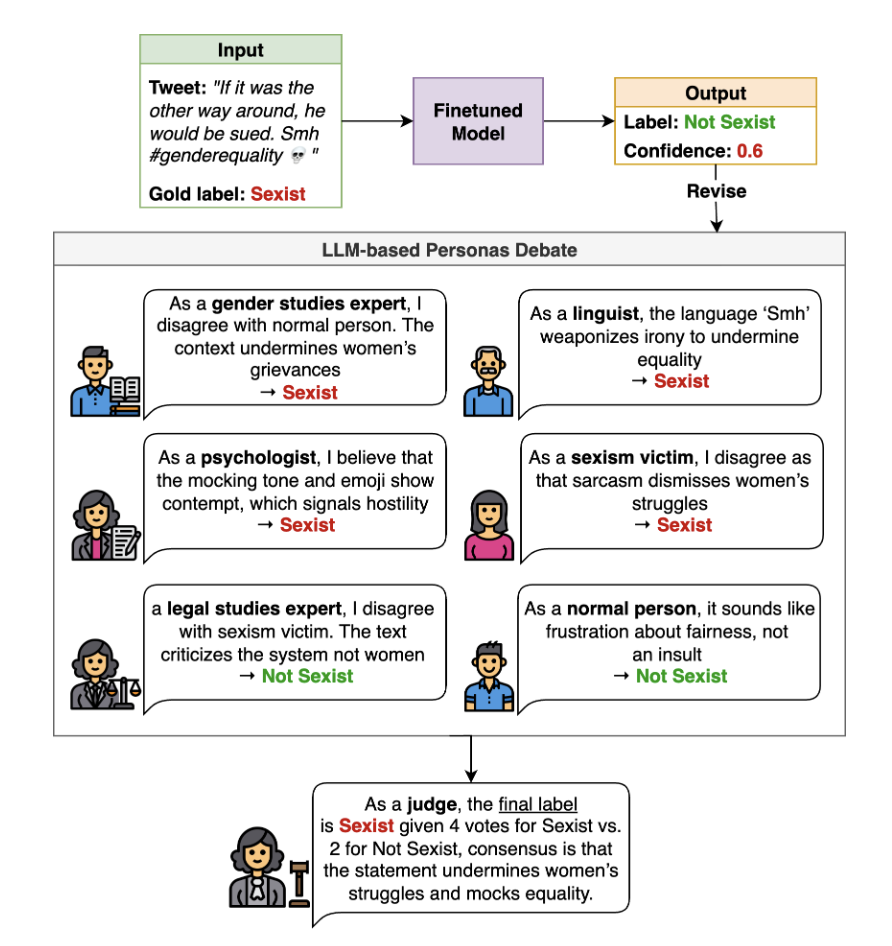

# When in Doubt, Consult

### Expert Debate for Sexism Detection via Confidence-Based Routing

This repository contains the code for the paper:

**"When in Doubt, Consult: Expert Debate for Sexism Detection via Confidence-Based Routing"**

ACL 2026 - Proceedings of the 64th Annual Meeting of the Association for Computational Linguistics (Volume 1: Long Papers)
July 2-7, 2026 ©2026 Association for Computational Linguistics

**Authors:** Anwar Alajmi and Gabriele Pergola


---

## Abstract

Online sexism increasingly appears in subtle, context-dependent forms that evade traditional detection methods. Its interpretation often depends on overlapping linguistic, psychological, legal, and cultural dimensions, which produce noisy and sometimes contradictory signals in annotated datasets. These inconsistencies, combined with label scarcity and class imbalance, result in unstable decision boundaries and cause fine-tuned models to overlook subtler, underrepresented forms of harm.

To address these challenges, we propose a two-stage framework that unifies (i) targeted training procedures to better regularize supervision to scarce and noisy data with (ii) selective, reasoning-based inference to handle ambiguous or borderline cases. First, we stabilize the training combining class-balanced focal loss, class-aware batching, and post-hoc threshold calibration, strategies for the first time adapted for this domain to mitigate label imbalance and noisy supervision. Second, we bridge the gap between efficiency and reasoning with a dynamic routing mechanism that distinguishes between unambiguous instances and complex cases requiring a deliberative process. This reasoning process results in the novel *Collaborative Expert Judgment* (CEJ) module which prompts multiple personas and consolidates their reasoning through a judge model. Our approach outperforms existing approaches across several public benchmarks, with F1 gains of +4.48% and +1.30% on EDOS Tasks A and B, respectively, and a +2.79% improvement in ICM on EXIST 2025 Task 1.1.

---

## Framework

<p align="center">
  
</p>

---

## Repository Structure

```
.
├── training/                       # Specialist model fine-tuning
│   ├── train_edos_a.py             # EDOS Task A (binary)
│   ├── train_edos_b.py             # EDOS Task B (4-way)
│   ├── train_edos_c.py             # EDOS Task C (11-way)
│   ├── train_exist_1.py            # EXIST 2025 Task 1.1 (binary)
│   ├── requirements.txt
│   ├── gitignore
│   └── README.md
├── debate/                         # Collaborative Expert Judgment (CEJ)
│   ├── cej_utils.py                # Shared personas, definitions, helpers
│   ├── cej_initial_opinions.py     # Stage 1: Initial persona opinions
│   ├── cej_debate.py               # Stage 2: Structured debate
│   ├── cej_summarize.py            # Stage 3: Debate summarization
│   ├── cej_judge.py                # Stage 4: Final judgment
│   ├── requirements.txt
│   └── CEJ_README.md
├── routing/                        # Confidence-aware routing
│   ├── routing_binary.py           # Binary tasks (confidence only)
│   ├── routing_b_c.py              # Multi-class tasks (confidence + margin)
│   └── routing_README.md
└── README.md
```

---

## Setup

```bash
git clone https://github.com/anonymous-project-2025/SexismDebate.git
cd SexismDebate
pip install -r training/requirements.txt
pip install -r debate/requirements.txt
```

Access to `meta-llama/Llama-3.2-3B` requires accepting the Meta LLaMA license on Hugging Face:

```bash
huggingface-cli login
```

The CEJ pipeline uses [Ollama](https://ollama.com/) for local LLM inference. Install Ollama and pull the models:

```bash
ollama pull llama3.3:70b
ollama pull qwen2.5:72b
ollama pull cogito:70b
```

---

## Usage

The framework consists of three stages that run sequentially.

### 1. Train the specialist model

```bash
# EDOS Task A (binary)
python training/train_edos_a.py --train_path data/edos.csv --output_dir runs/task_a

# EDOS Task B (4-way categorization)
python training/train_edos_b.py --data_path data/edos.csv --output_dir runs/task_b

# EDOS Task C (11-way fine-grained)
python training/train_edos_c.py --data_path data/edos.csv --output_dir runs/task_c

# EXIST 2025 Task 1.1 (binary, outputs EvALL-format JSON)
python training/train_exist_1.py \
  --train_path data/exist2025_train.json \
  --dev_path data/exist2025_dev.json \
  --test_path data/exist2025_test.json \
  --output_predictions predictions/exist_task1_1_hard.json
```

### 2. Run CEJ on low-confidence samples

The CEJ pipeline processes samples through four stages. See `debate/CEJ_README.md` for details.

```bash
# Stage 1: Initial persona opinions
python debate/cej_initial_opinions.py \
  --input_path data/routed_samples.json \
  --output_path outputs/initial_opinions.json \
  --model <persona_model>

# Stage 2: Structured debate
python debate/cej_debate.py \
  --input_path outputs/initial_opinions.json \
  --output_path outputs/debate.json \
  --model <persona_model>

# Stage 3: Summarization
python debate/cej_summarize.py \
  --input_path outputs/debate.json \
  --output_path outputs/summaries.json \
  --model <persona_model>

# Stage 4: Final judgment
python debate/cej_judge.py \
  --input_path outputs/summaries.json \
  --output_path outputs/judgments.json \
  --model <judge_model>
```

### 3. Route predictions

Merge specialist and CEJ predictions using confidence-based routing.

```bash
# Binary tasks (Task A / EXIST): confidence threshold only
python routing/routing_binary.py \
  --specialist_csv predictions/task_a_test.csv \
  --judge_json outputs/judgments.json \
  --tau_conf <threshold> \
  --output_path predictions/task_a_routed.csv

# Multi-class tasks (Task B / Task C): confidence + margin thresholds
python routing/routing_b_c.py \
  --specialist_csv predictions/task_b_test.csv \
  --judge_json outputs/judgments.json \
  --tau_conf <threshold> \
  --tau_margin <threshold> \
  --output_path predictions/task_b_routed.csv
```

---

## Datasets

**EDOS** (SemEval-2023 Task 10): Publicly available.
[EDOS on PapersWithCode](https://paperswithcode.com/task/sexism-detection-semeval-2023-task-10)

**EXIST 2025**: Publicly available. Please follow the official organizers' terms to access the dataset. Evaluation must be performed using Evaluate ALL 2.0, available at: [https://evall.uned.es/](https://evall.uned.es/)

---

## Citation

```bibtex
@inproceedings{alajmi-pergola-2026-doubt,
    title = "When in Doubt, Consult: Expert Debate for Sexism Detection via Confidence-Based Routing",
    author = "Alajmi, Anwar  and
      Pergola, Gabriele",
    editor = "Liakata, Maria  and
      Moreira, Viviane P.  and
      Zhang, Jiajun  and
      Jurgens, David",
    booktitle = "Proceedings of the 64th Annual Meeting of the {A}ssociation for {C}omputational {L}inguistics (Volume 1: Long Papers)",
    month = jul,
    year = "2026",
    address = "San Diego, California, United States",
    publisher = "Association for Computational Linguistics",
    url = "https://aclanthology.org/2026.acl-long.1936/",
    doi = "10.18653/v1/2026.acl-long.1936",
    pages = "41800--41822",
    ISBN = "979-8-89176-390-6",
    abstract = "Online sexism increasingly appears in subtle, context-dependent forms that evade traditional detection methods. Its interpretation often depends on overlapping linguistic, psychological, legal, and cultural dimensions, which produce mixed and sometimes contradictory signals in annotated datasets. These inconsistencies, combined with label scarcity and class imbalance, result in unstable decision boundaries and cause fine-tuned models to overlook subtler, underrepresented forms of harm. To address these challenges, we propose a two-stage framework that unifies (i) targeted training procedures to better regularize supervision to scarce and noisy data with (ii) selective, reasoning-based inference to handle ambiguous or borderline cases. First, we stabilize the training combining class-balanced focal loss, class-aware batching, and post-hoc threshold calibration, strategies for the firs time adapted for this domain to mitigate label imbalance and noisy supervision. Second, we bridge the gap between efficiency and reasoning with a a dynamic routing mechanism that distinguishes between unambiguous instances and complex cases requiring a deliberative process. This reasoning process results in the novel Collaborative Expert Judgment (CEJ) module which prompts multiple personas and consolidates their reasoning through a judge model. Our approach outperforms existing approaches across several public benchmarks, with F1 gains of +4.48{\%} and +1.30{\%} on EDOS Tasks A and B, respectively, and a +2.79{\%} improvement in ICM on EXIST 2025 Task 1.1."
}
```
